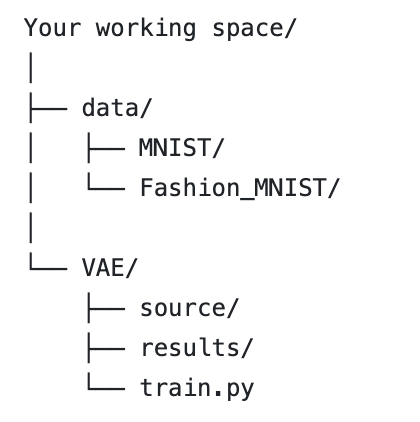

# VAE
## Introduction
This report presents my investigation into Variational Autoencoders (VAEs), a powerful class of generative models. I made an in-depth exploration of the mathematical formulations underpinning VAE and achieved a comprehensive understanding of latent models. I implemented VAE from scratch and tested them on MNIST and FashionMNIST dataset. I also implemented two network structures (MLP-based and CNN-based encoder-decoder architectures), and a comparative analysis was performed between them, as well as different latent space dimensions, revealing insights into how specific network architectures can influence overall performance.
More details can be found in Variational_Autoencoders.pdf

## Download the dataset
This model uses both MNIST dataset and Fashion MNIST dataset. Please download the data (four .gz files for both datasets), and
put the data to "data/MNIST" or "data/Fashion_MNIST". The file structure is illustrated below:

## How to run
To run the model, go to the working directory, and just type "python VAE/train.py" in the terminal, the model will be trained by default parameters. You can look at how to change hyperparameters by running "python VAE/train.py -h" and use command line codes to change them. e.g., the dataset used for training, the latent dimension, the architecture for the model .etc.

## Result
You can visualize the training result by looking at /result folder, including the training curve, the visualized latent space, and the generation result.
